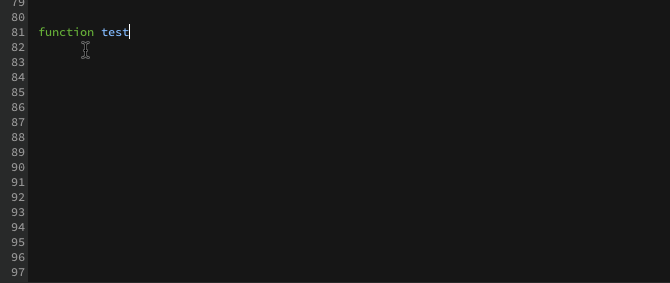

Auto-Brackets
======

An extension for [Brackets](https://github.com/adobe/brackets/) for automatic closure of brackets and curly braces on enter key.

### How to Install

1. Select Brackets > File > Extension Manager
2. Search for this extension.
3. Click on the Install button.

### How to use Auto-Brackets
When you write { , [ or ( and press enter, closes the tag and leaves the cursor in the middle line with correct indentation.

***
Tested on Brackets Sprint 39, Mac OS X.